## Overall project checklist

The checklist is *exhaustive* which means that it includes everything that you could do on the project included in the curriculum in this course. Therefore, we do not expect at all that you have checked all boxes at the end of the project.

The parenthesis at the end indicates what module the bullet point is related to. Please be honest in your answers, we will check the repositories and the code to verify your answers.

### Week 1

* [x] Create a git repository (M5)
* [x] Make sure that all team members have write access to the GitHub repository (M5)
* [x] Create a dedicated environment for you project to keep track of your packages (M2)
* [x] Create the initial file structure using cookiecutter with an appropriate template (M6)
* [x] Fill out the `data.py` file such that it downloads whatever data you need and preprocesses it (if necessary) (M6)
* [x] Add a model to `model.py` and a training procedure to `train.py` and get that running (M6)
* [x] Remember to either fill out the `requirements.txt`/`requirements_dev.txt` files or keeping your `pyproject.toml`/`uv.lock` up-to-date with whatever dependencies that you are using (M2+M6)
* [x] Remember to comply with good coding practices (`pep8`) while doing the project (M7)
* [x] Do a bit of code typing and remember to document essential parts of your code (M7)
* [x] Setup version control for your data or part of your data (M8)
* [x] Add command line interfaces and project commands to your code where it makes sense (M9)
* [x] Construct one or multiple docker files for your code (M10)
* [x] Build the docker files locally and make sure they work as intended (M10)
* [x] Write one or multiple configurations files for your experiments (M11)
* [x] Used Hydra to load the configurations and manage your hyperparameters (M11)
* [x] Use profiling to optimize your code (M12)
* [x] Use logging to log important events in your code (M14)
* [x] Use Weights & Biases to log training progress and other important metrics/artifacts in your code (M14)
* [x] Consider running a hyperparameter optimization sweep (M14)
* [ ] Use PyTorch-lightning (if applicable) to reduce the amount of boilerplate in your code (M15)

### Week 2

* [x] Write unit tests related to the data part of your code (M16)
* [x] Write unit tests related to model construction and or model training (M16)
* [x] Calculate the code coverage (M16)
* [x] Get some continuous integration running on the GitHub repository (M17)
* [ ] Add caching and multi-os/python/pytorch testing to your continuous integration (M17)
* [x] Add a linting step to your continuous integration (M17)
* [x] Add pre-commit hooks to your version control setup (M18)
* [ ] Add a continues workflow that triggers when data changes (M19)
* [ ] Add a continues workflow that triggers when changes to the model registry is made (M19)
* [x] Create a data storage in GCP Bucket for your data and link this with your data version control setup (M21)
* [x] Create a trigger workflow for automatically building your docker images (M21)
* [x] Get your model training in GCP using either the Engine or Vertex AI (M21)
* [x] Create a FastAPI application that can do inference using your model (M22)
* [x] Deploy your model in GCP using either Functions or Run as the backend (M23)
* [ ] Write API tests for your application and setup continues integration for these (M24)
* [x] Load test your application (M24)
* [x] Create a more specialized ML-deployment API using either ONNX or BentoML, or both (M25)
* [x] Create a frontend for your API (M26)

### Week 3

* [x] Check how robust your model is towards data drifting (M27)
* [x] Setup collection of input-output data from your deployed application (M27)
* [x] Deploy to the cloud a drift detection API (M27)
* [x] Instrument your API with a couple of system metrics (M28)
* [x] Setup cloud monitoring of your instrumented application (M28)
* [x] Create one or more alert systems in GCP to alert you if your app is not behaving correctly (M28)
* [ ] If applicable, optimize the performance of your data loading using distributed data loading (M29)
* [ ] If applicable, optimize the performance of your training pipeline by using distributed training (M30)
* [ ] Play around with quantization, compilation and pruning for you trained models to increase inference speed (M31)

### Extra

* [x] Write some documentation for your application (M32)
* [x] Publish the documentation to GitHub Pages (M32)
* [x] Revisit your initial project description. Did the project turn out as you wanted?
* [x] Create an architectural diagram over your MLOps pipeline
* [x] Make sure all group members have an understanding about all parts of the project
* [x] Uploaded all your code to GitHub

## Group information

### Question 1
>
> **Enter the group number you signed up on <learn.inside.dtu.dk>**
>
> Answer:

69

### Question 2
>
> **Enter the study number for each member in the group**
>
> Example:
>
> *sXXXXXX, sXXXXXX, sXXXXXX*
>
> Answer:

s225224, s205357, s254124, s211548, s215489

### Question 3
>
> **Did you end up using any open-source frameworks/packages not covered in the course during your project? If so**
> **which did you use and how did they help you complete the project?**
>
> Recommended answer length: 0-200 words.
>
> Example:
> *We used the third-party framework ... in our project. We used functionality ... and functionality ... from the*
> *package to do ... and ... in our project*.
>
> Answer:

We used TIMM (PyTorch Image Models) to access pre-trained ResNet18 models. For the frontend, we used SvelteKit as our web framework and Tailwind CSS for styling, to give us a cool user interface for image uploads and predictions. Other examples of open source tools that we used are:

* FastAPI for building the backend API endpoints
* Hydra for managing configurations and hyperparameter sweeps
* DVC to track our dataset
* Pytest and Ruff to for nice code quality with automated testing and linting
* Prometheus for monitoring our model's performance and health in production
* Docker to containerize our application

## Coding environment

> In the following section we are interested in learning more about you local development environment. This includes
> how you managed dependencies, the structure of your code and how you managed code quality.

### Question 4

> **Explain how you managed dependencies in your project? Explain the process a new team member would have to go**
> **through to get an exact copy of your environment.**
>
> Recommended answer length: 100-200 words
>
> Example:
> *We used ... for managing our dependencies. The list of dependencies was auto-generated using ... . To get a*
> *complete copy of our development environment, one would have to run the following commands*
>
> Answer:

We used uv for dependency management with all dependencies defined in pyproject.toml and locked versions in uv.lock. To set up the environment, a new team member would:

1. Clone the repository from GitHub
2. Run `uv sync` to install exact dependency versions
3. Add their email to `src/drone_detector_mlops/permissions/cloud_members.txt`
4. An admin would run the permission setup scripts to get GCP access
5. Install and authenticate gcloud CLI for cloud services
6. Create a .env file with WANDB_API_KEY for experiment tracking

### Question 5

> **We expect that you initialized your project using the cookiecutter template. Explain the overall structure of your**
> **code. What did you fill out? Did you deviate from the template in some way?**
>
> Recommended answer length: 100-200 words
>
> Example:
> *From the cookiecutter template we have filled out the ... , ... and ... folder. We have removed the ... folder*
> *because we did not use any ... in our project. We have added an ... folder that contains ... for running our*
> *experiments.*
>
> Answer:

```plaintext
drone-detector-mlops/
├── src/drone_detector_mlops/      # Main package
│   ├── data/                      # Dataloader & augmentations
│   ├── workflows/                 # Training & testing
│   ├── api/                       # FastAPI service
│   ├── utils/                     # Storage, settings, and logging
│   ├── permissions/               # Access definitions for members
│   └── model.py                   # ResNet18 model
├── tests/                         # Unit & load tests
├── configs/                       # Hydra configurations
├── data/                          # Local dataset (drone/, bird/, splits/)
├── models/                        # Trained model (.pth)
├── cloud/                         # Cloud services
├── dockerfiles/                   # Containerization
├── frontend/                      # User inteface
├── scripts/                       # Executable scripts
├── reports/                       # Project report
├── tasks.py                       # Invoke tasks
└── pyproject.toml                 # Dependencies
```

We deviated by adding:

* `cloud/` - GCP deployment configs (Cloud Build, Vertex AI)
* `frontend/` - SvelteKit web UI
* `tasks.py` - Invoke command definitions

We deleted `notebooks/` as we didn't use exploratory notebooks, focusing instead on production code.

The main sauce of the codebase is in `src/drone_detector_mlops` which contains the domain logic. In contrast, we have more MLOps centered code in `dockerfiles/`, `cloud/`, `tests/`, etc. Essentially, we have separated what the project does from how and where it runs.

### Question 6

> **Did you implement any rules for code quality and format? What about typing and documentation? Additionally,**
> **explain with your own words why these concepts matters in larger projects.**
>
> Recommended answer length: 100-200 words.
>
> Example:
> *We used ... for linting and ... for formatting. We also used ... for typing and ... for documentation. These*
> *concepts are important in larger projects because ... . For example, typing ...*
>
> Answer:

We used Ruff for both linting and formatting. Pre-commit hooks (using prek - a rust based alternative to pre-commit) auto-enforces code quality before commits, checking for trailing whitespace, EOF issues, YAML validity, large files, and running Ruff.

We have type hints throughout the codebase and added docstrings to classes and key functions for documentation.

These concepts matter in larger projects because they make sure there is some consistency across team members' contributions, making code easier to read and maintain. Type hints catch bugs early by having static analysis - we also use dataclasses often for I/O as it makes sure we have some validation.

Consistent formatting reduces annoying style debates and gives us fewer merge conflicts. Pre-commit hooks prevent quality issues from entering the repository, giving us a clean git history. In our 5-person team, these practices ensured everyone could understand and modify each other's code without confusion.

## Version control

> In the following section we are interested in how version control was used in your project during development to
> corporate and increase the quality of your code.

### Question 7

> **How many tests did you implement and what are they testing in your code?**
>
> Recommended answer length: 50-100 words.
>
> Example:
> *In total we have implemented X tests. Primarily we are testing ... and ... as these the most critical parts of our*
> *application but also ... .*
>
> Answer:

We implemented 385 unit tests covering data loading, model architecture, training/validation workflows, storage operations, and utilities. We tested dataset creation, image transforms, split generation, model forward passes, gradient flow, training loops, and GCS cloud storage integration. For the API, we have a test placeholder ready for expansion and a separate Locust-based load testing suite for performance validation.

We tried to maximize code coverage for fun, which might not be best practice in real projects since high coverage doesn't guarantee bug-free code. However, it was a good learning exercise in thorough testing.

### Question 8

> **What is the total code coverage (in percentage) of your code? If your code had a code coverage of 100% (or close**
> **to), would you still trust it to be error free? Explain you reasoning.**
>
> Recommended answer length: 100-200 words.
>
> Example:
> *The total code coverage of code is X%, which includes all our source code. We are far from 100% coverage of our **
> *code and even if we were then...*
>
> Answer:

Our code coverage is 97% and no, we would not trust code to be error-free even at 100% coverage. Code coverage only measures which lines were executed during tests, not whether the tests are actually good or whether the code is correct.

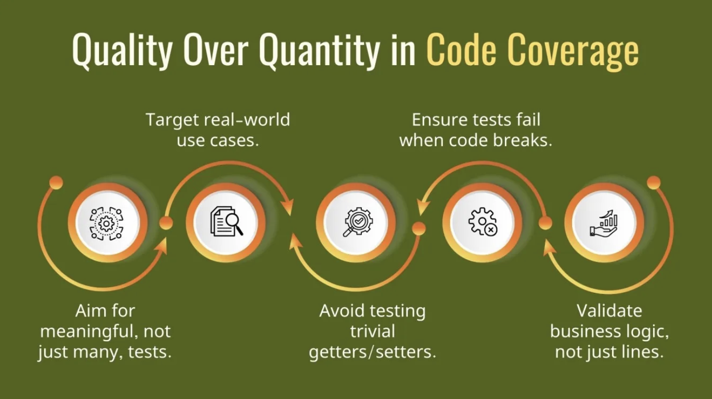

(<https://www.frugaltesting.com/blog/what-is-code-coverage-in-software-testing-tools-types-and-how-to-improve-them>)

It’s easy to reach a high number by testing only the easy, "happy" paths while missing the the "bad" situations where bugs usually hide. We use coverage as a helpful tool, but it isn't a promise of perfection. Real trust comes from writing smart tests that handle real-world scenarios rather than just trying to make a percentage go up. We enjoyed the article from Frugal Testing on what code coverage should aim for.

### Question 9

> **Did you workflow include using branches and pull requests? If yes, explain how. If not, explain how branches and**
> **pull request can help improve version control.**
>
> Recommended answer length: 100-200 words.
>
> Example:
> *We made use of both branches and PRs in our project. In our group, each member had an branch that they worked on in*
> *addition to the main branch. To merge code we ...*
>
> Answer:

We used branches a lot with a naming convention of initials followed by the feature (fx., `lju/add-cloudbuild`). Every feature or fix got its own branch. Main was protected, so all code had to go through pull requests with team review.

Our workflow: create branch, implement feature, push, open PR, get reviewed, merge to main. We used a Claude Code skill (`make pr`) to help generate PR titles and descriptions.

For work-in-progress features, we prefixed PRs with WIP so the team could see what was being worked on without expecting it to be ready for review.

GitHub Actions checked if PR branches were up-to-date with main before running other workflows to save runner time. Linting and tests had to pass before merging.

We didn't auto-delete branches after merge, which cluttered our branch list. We also didn't squash commits. In hindsight, doing these two things would have kept the repository cleaner.

### Question 10

> **Did you use DVC for managing data in your project? If yes, then how did it improve your project to have version**
> **control of your data. If no, explain a case where it would be beneficial to have version control of your data.**
>
> Recommended answer length: 100-200 words.
>
> Example:
> *We did make use of DVC in the following way: ... . In the end it helped us in ... for controlling ... part of our*
> *pipeline*
>
> Answer:

Yes, we used DVC to manage our dataset. We tracked the `bird/` and `drone/` directories with DVC, storing the actual images in GCS while keeping .dvc files with MD5 hashes in git. This kept our repository clean and made sure everyone on the team had the same dataset version. We set up DVC but didn't actively create new data versions since our dataset stayed the same throughout the project.

However, we see that in a real deployment scenario where we'd be collecting new data, retraining models, or fixing data quality issues, DVC would be very smart for tracking what data produced which model.

DVC did help us with reproducibility by making sure all team members could run `dvc pull` to get the exact same dataset.

### Question 11

> **Discuss you continuous integration setup. What kind of continuous integration are you running (unittesting,**
> **linting, etc.)? Do you test multiple operating systems, Python  version etc. Do you make use of caching? Feel free**
> **to insert a link to one of your GitHub actions workflow.**
>
> Recommended answer length: 200-300 words.
>
> Example:
> *We have organized our continuous integration into 3 separate files: one for doing ..., one for running ... testing*
> *and one for running ... . In particular for our ..., we used ... .An example of a triggered workflow can be seen*
> *here: <weblink>*
>
> Answer:

We organized our CI into 8 main workflows:

**On Pull Requests:**

* **tests.yaml**: Runs unit tests with pytest and coverage across 3 operating systems (Ubuntu, Windows, macOS) and 2 Python versions (3.11, 3.12). This is a matrix of 6 test jobs.
* **linting.yaml**: Runs pre-commit hooks with Ruff.
* **build.yaml**: Builds Docker images when relevant paths change.

**On Push to Main:**

* **deploy.yaml**: Builds API Docker image with Cloud Build and deploys to Cloud Run automatically.

**Manual Triggers:**

* **train.yaml**: Builds training Docker image and submits job to Vertex AI for GPU training.

**Utilities:**

* **check-branch-updated.yaml**: Checks if PR branches are up-to-date with main before running other workflows.
* **data-change.yaml**: Triggers when data changes.
* **pre-commit-update.yaml**: Auto-updates pre-commit hooks.

We use caching via astral-sh/setup-uv action which automatically caches uv tools and Python dependencies. We also have Dependabot, CodeQL security scanning, and GitHub Copilot for code reviews.

Example: <https://github.com/dtu-mlops/drone-detection-mlops/actions/workflows/deploy.yaml>

## Running code and tracking experiments

> In the following section we are interested in learning more about the experimental setup for running your code and
> especially the reproducibility of your experiments.

### Question 12

> **How did you configure experiments? Did you make use of config files? Explain with coding examples of how you would**
> **run a experiment.**
>
> Recommended answer length: 50-100 words.
>
> Example:
> *We used a simple argparser, that worked in the following way: Python  my_script.py --lr 1e-3 --batch_size 25*
>
> Answer:

We used Hydra to manage experiment configurations with YAML files in the `configs/` directory. The main `config.yaml` references hyperparameter configs like `param_1.yaml` and `param_2.yaml`, each defining different values for learning rate, batch size, and epochs.

**Local training:**

Although not used often, for peace of mind we can train locally. Just remember to change the storage mode in [`settings.py`](src/drone_detector_mlops/utils/settings.py) to "local":

```bash
invoke train
```

**Cloud training (Vertex AI):**

This is how we most often run training jobs. Remember to change storage mod [`settings.py`](src/drone_detector_mlops/utils/settings.py) to "cloud":

```bash
invoke cloud_train
```

Single run with specific hyperparameters:

```bash
invoke cloud_train --epochs=20 --batch-size=128 --lr=0.001
```

Hyperparameter sweep (20 Optuna trials on GPU). We didn't provide an invoke task for this, since (1) it is fairly simple and (2) it is not intended to be run too often:

```bash
uv run -m scripts.submit_training --sweep --yes
```

Both cloud commands submit jobs to Vertex AI with an n1-standard-4 machine + T4 GPU.

### Question 13

> **Reproducibility of experiments are important. Related to the last question, how did you secure that no information**
> **is lost when running experiments and that your experiments are reproducible?**
>
> Recommended answer length: 100-200 words.
>
> Example:
> *We made use of config files. Whenever an experiment is run the following happens: ... . To reproduce an experiment*
> *one would have to do ...*
>
> Answer:

We used some different techniques to make sure we have reproduceble results:

**Hydra Configuration:** Every training run logs the complete Hydra config to both console and W&B, including all hyperparameters and settings. The config files are version controlled in git.

**Weights & Biases:** All experiments are automatically tracked with hyperparameters (lr, batch_size, epochs), metrics (train/val loss/accuracy), device info, and model artifacts. Each run has a unique ID.

**Data Versioning:** DVC tracks our dataset with MD5 hashes in GCS, ensuring all team members use identical data. We use a fixed random seed for train/val/test splits.

**Environment Reproducibility:** Docker containers pin all dependencies, and uv.lock makes sure of the exact package versions.

**Model Artifacts:** Models are saved with hyperparameters in the filename (fx., `model-lr0.001-bs16-e10-20250121.pth`) and uploaded to W&B with metadata.

We didn't set PyTorch random seeds for training, so there might cause minor variations in results. This was primarily done to make sure the performance is generalizable, although we do realize that some of the best Kaggler's out there will use the seed as a tunable hyperparameter - which of course it is really not.

### Question 14

> **Upload 1 to 3 screenshots that show the experiments that you have done in W&B (or another experiment tracking**
> **service of your choice). This may include loss graphs, logged images, hyperparameter sweeps etc. You can take**
> **inspiration from [this figure](figures/wandb.png). Explain what metrics you are tracking and why they are**
> **important.**
>
> Recommended answer length: 200-300 words + 1 to 3 screenshots.
>
> Example:
> *As seen in the first image when have tracked ... and ... which both inform us about ... in our experiments.*
> *As seen in the second image we are also tracking ... and ...*
>
> Answer:

We ran a 20-trial Optuna hyperparameter sweep on Vertex AI, tracking validation/training loss and accuracy across different learning rates, batch sizes, and epoch counts.

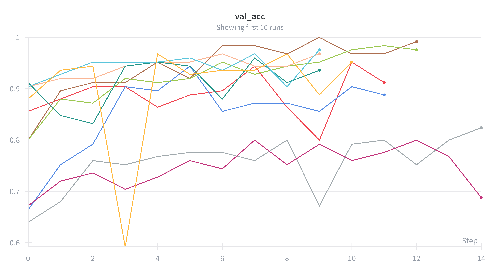

**Validation Accuracy:** Most trials converged to 90%+ validation accuracy, showing that the ResNet18 architecture works well for drone vs bird classification. A few trials struggled, plateauing around 70-80% - likely due to learning rates that were too high or unlucky hyperparameter combinations that Optuna sampled early in the search.

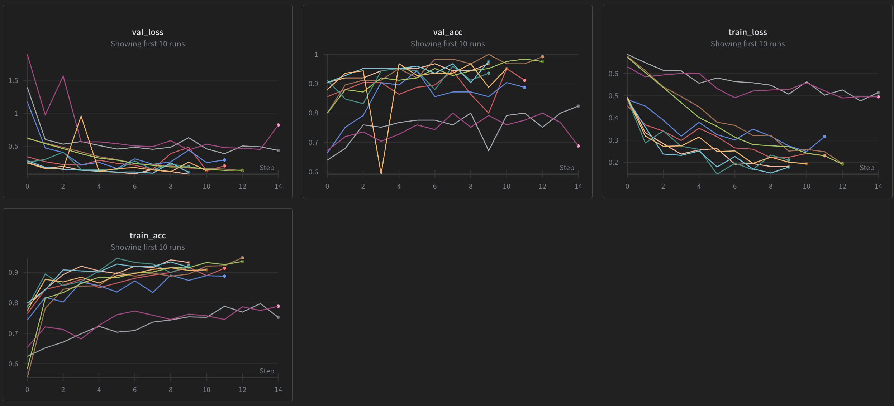

**Train/Val Loss & Accuracy:** The four-panel view shows generalization behavior. Most runs show training and validation metrics tracking closely together, indicating good generalization without significant overfitting. All in all looks pretty nice.

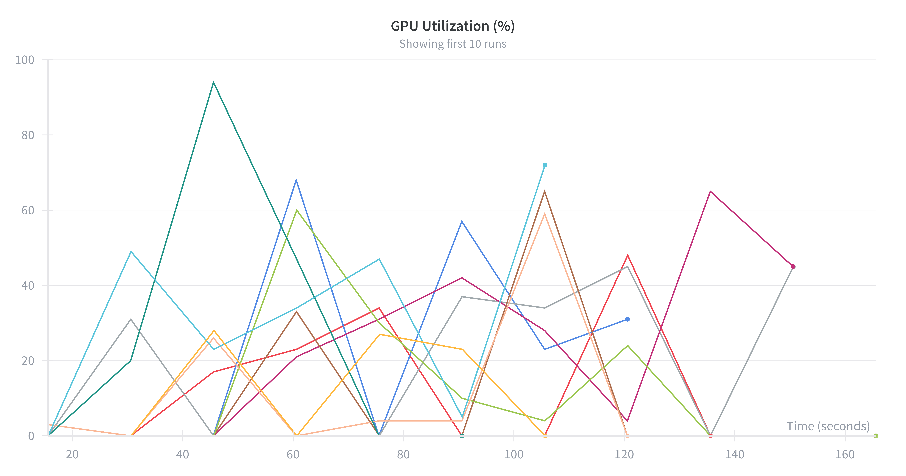

**GPU Utilization:** This shows a bottleneck. GPU utilization is poor, often below 50% with occasional spikes. We believe the GPU is starving for data, waiting on the data loading pipeline. This is likely caused by:

* **GCS data fetching:** Images are loaded from Google Cloud Storage with network latency
* **Small batch sizes:** Some trials used batch_size=8 or 16, leaving the GPU underutilized
* **Limited workers:** Only 4 data loader workers for fetching from cloud storage

There is room for improvement on the training efficiency here - but the model performance is solid regardless.

### Question 15

> **Docker is an important tool for creating containerized applications. Explain how you used docker in your**
> **experiments/project? Include how you would run your docker images and include a link to one of your docker files.**
>
> Recommended answer length: 100-200 words.
>
> Example:
> *For our project we developed several images: one for training, inference and deployment. For example to run the*
> *training docker image: `docker run trainer:latest lr=1e-3 batch_size=64`. Link to docker file: <weblink>*
>
> Answer:

We created three Docker images: one for training, one for the FastAPI backend, and one for the SvelteKit frontend.

**Local builds:**

```bash
invoke docker_build_train
invoke docker_build_api
invoke docker_build_frontend
```

Cloud Build (GCP):

```bash
invoke cloud_build_api
invoke cloud_build_frontend
```

All images use multi-stage builds to keep sizes small. The training image includes PyTorch with CUDA support, while the API image uses ONNX Runtime for faster CPU inference.

Example API Dockerfile: <https://github.com/dtu-mlops/drone-detection-mlops/blob/main/dockerfiles/api.dockerfile>. This image auto-deploys to Cloud Run on every push to main.

The frontend is a separate lightweight container serving the web UI. These containers communicate in production - the frontend calls the API, which loads the ONNX model for predictions.

### Question 16

> **When running into bugs while trying to run your experiments, how did you perform debugging? Additionally, did you**
> **try to profile your code or do you think it is already perfect?**
>
> Recommended answer length: 100-200 words.
>
> Example:
> *Debugging method was dependent on group member. Some just used ... and others used ... . We did a single profiling*
> *run of our main code at some point that showed ...*
>
> Answer:

We used logging statements to debug our code. If we ran it locally we could easily see the logs, but if we ran it in GCP we could see the logs there. They weren't always very helpful, so we sometimes had to add more logging statements to get to the bottom of the issue. Also we used Claude Code to help us debug the code, if we couldn't find the issue ourselves.

**Profiling:** We set up PyTorch profiling on our cloud training jobs and analyzed the data using TensorBoard locally. Profiling data was uploaded to the models bucket - in hindsight, we should have created a separate bucket for better organization. We identified bottlenecks like GPU underutilization from slow GCS data loading. We didn't manage to host the TensorBoard dashboard on a cloud service, so analysis was done locally by downloading the profiling traces.

**Cloud storage of profiling data:** When running profiling in the cloud, we save the profiling results to GCS under `gs://drone-detection-mlops-models/profiler/<run-name>/`. The traces are stored as JSON files. For now we would need to download the profiling data from GCS and run TensorBoard locally with `tensorboard --logdir=<downloaded-profiler-dir>` for deeper analysis. If we had more time we would have made an API endpoint or Cloud Run service that serves TensorBoard directly, so users could visualize profiling traces without manually downloading files.

**Results:** On Vertex AI, the data loading was the bottleneck consuming 97% of CPU time. Meanwhile, actual CUDA computation was much faster. This confirms the GPU was starving for data while waiting on the single-process data loader fetching from GCS.

We didn't have time to act on these findings, but for our dataset size and training frequency the training time was acceptable.

## Working in the cloud

> In the following section we would like to know more about your experience when developing in the cloud.

### Question 17

> **List all the GCP services that you made use of in your project and shortly explain what each service does?**
>
> Recommended answer length: 50-200 words.
>
> Example:
> *We used the following two services: Engine and Bucket. Engine is used for... and Bucket is used for...*
>
> Answer:

We used the following GCP services:

* **Cloud Storage (GCS Buckets)**: Used for storing training data (`gs://drone-detection-mlops-data/structured`) and trained model checkpoints (`gs://drone-detection-mlops-models`). The storage module abstracts local vs cloud storage access.
* **Artifact Registry**: Stores our Docker container images for the API, frontend, and training containers.
* **Cloud Build**: Automates building Docker images for all three components (api, frontend, train) with each their own cloudbuild configurations.
* **Cloud Run**: Hosts our inference API as a serverless container with autoscaling (1-10 instances), 4GB memory, and 2 vCPUs per instance. Includes a GMP sidecar for metrics collection.
* **Vertex AI**: Runs training jobs via `CustomContainerTrainingJob`, supporting both CPU and GPU (NVIDIA Tesla T4) instances with configurable machine types and Hydra-based hyperparameter sweeps.
* **Cloud Logging**: Centralized logging for Cloud Build jobs and Cloud Run services (configured via `logging: CLOUD_LOGGING_ONLY`).

### Question 18

> **The backbone of GCP is the Compute engine. Explained how you made use of this service and what type of VMs**
> **you used?**
>
> Recommended answer length: 100-200 words.
>
> Example:
> *We used the compute engine to run our ... . We used instances with the following hardware: ... and we started the*
> *using a custom container: ...*
>
> Answer:

We didn't manually manage Compute Engine VMs. Instead, we used Vertex AI, which automatically provisions VMs, runs our Docker container on them, and tears them down when training finishes.

* **Vertex AI** handles our training workloads
* **Cloud Build** builds our Docker images
* **Cloud Run** serves our API and frontend as serverless containers

**Hardware we used:**

* Machine type: n1-standard-4 (4 vCPUs, 15GB RAM)
* GPU: NVIDIA Tesla T4

We used n1-standard-4 + T4 because it was the only setup we could get working. Getting GPU access from Google was a hassle - we had to request quota increases and wait for approval. Sometimes T4 GPUs aren't even available in our region, so our training jobs get blocked until capacity frees up.

### Question 19

> **Insert 1-2 images of your GCP bucket, such that we can see what data you have stored in it.**
> **You can take inspiration from [this figure](figures/bucket.png).**
>
> Answer:

We created 6 buckets, but mainly used the data and model buckets. One was for storing data (all training data in DVC, data split configs and inference data), the other was for storing models. Profiling data ended up in the model bucket, however in hindsight, we would have seperated it to its own bucket for better clarity.

Overview of the buckets. Notice that there are a few "extra" - this is because we experimented with different regions for training:

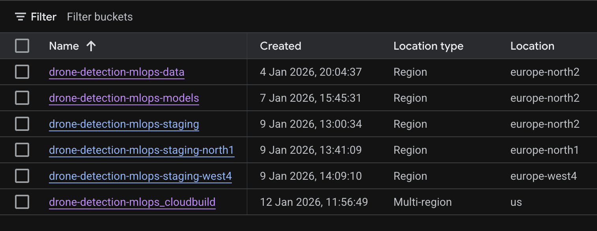

Folders in the data bucket:

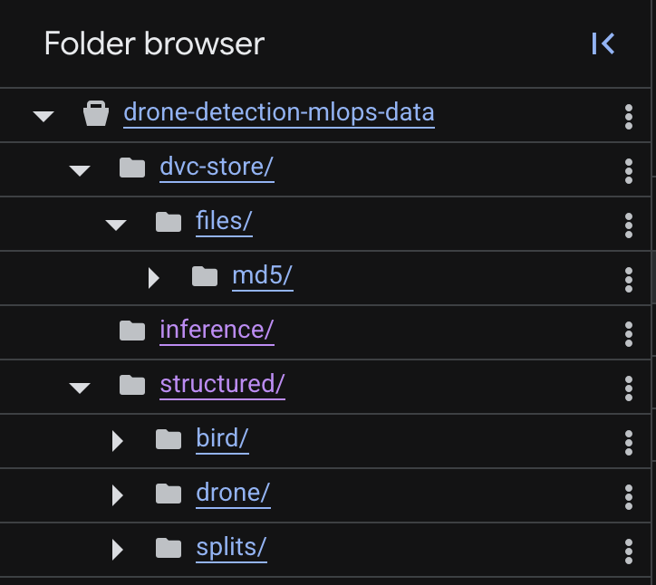

Folders in the model bucket:

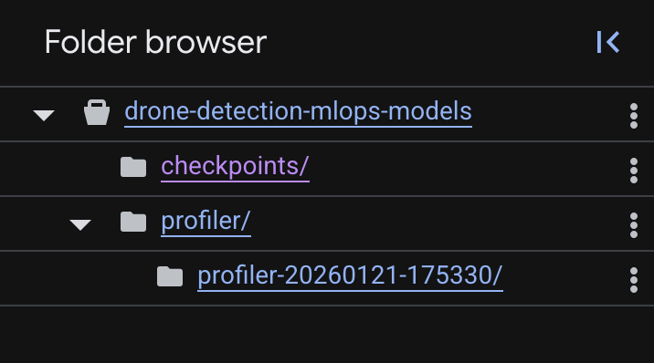

### Question 20

> **Upload 1-2 images of your GCP artifact registry, such that we can see the different docker images that you have**
> **stored. You can take inspiration from [this figure](figures/registry.png).**
>
> Answer:

We had 3 images in the artifact registry: the API image, the frontend image and the training image.

Overview of the artifact registry:

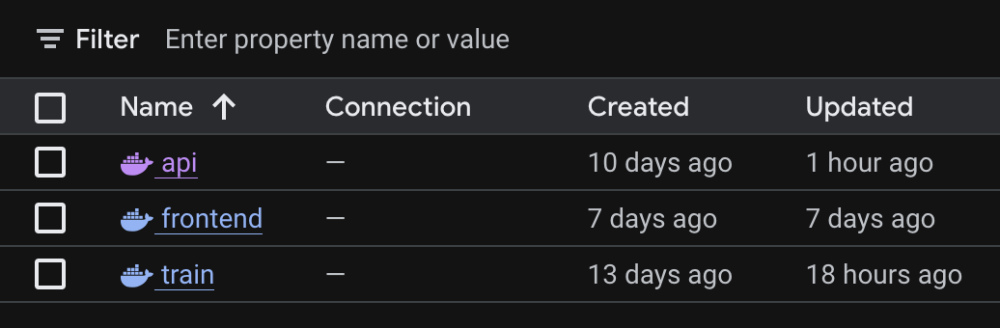

API image digest:

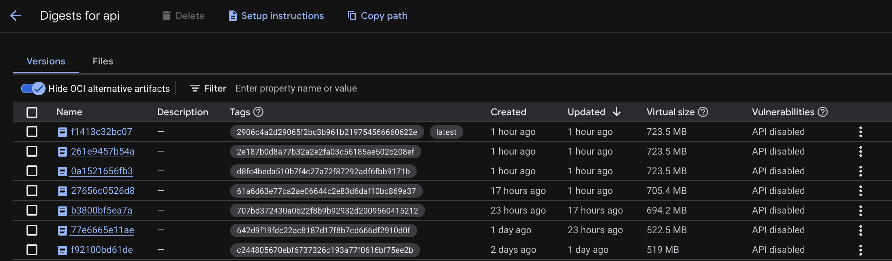

### Question 21

> **Upload 1-2 images of your GCP cloud build history, so we can see the history of the images that have been build in**
> **your project. You can take inspiration from [this figure](figures/build.png).**
>
> Answer:

We built +80 images in total.

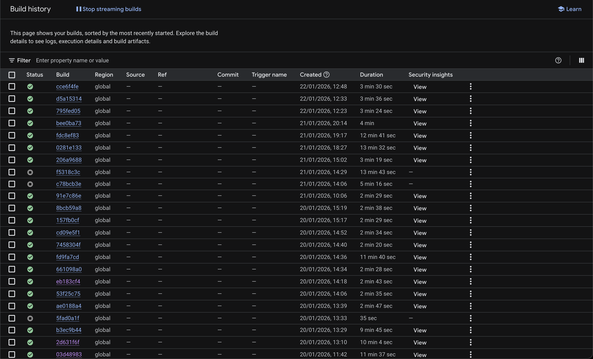

### Question 22

> **Did you manage to train your model in the cloud using either the Engine or Vertex AI? If yes, explain how you did**
> **it. If not, describe why.**
>
> Recommended answer length: 100-200 words.
>
> Example:
> *We managed to train our model in the cloud using the Engine. We did this by ... . The reason we choose the Engine*
> *was because ...*
>
> Answer:

Yes, we trained our model in the cloud using Vertex AI. We created a training Docker image and submitted a training job with `invoke cloud-train`. We can also specify a full sweep, or custom hyperparameters with this invoke task.

The submission script sets environment variables for cloud mode, W&B API key, GCS paths, and Hydra config overrides. Jobs run synchronously and log to both console and W&B. We also ran a 20-trial Optuna hyperparameter sweep using `uv run -m scripts.submit_training --sweep --yes`.

## Deployment

### Question 23

> **Did you manage to write an API for your model? If yes, explain how you did it and if you did anything special. If**
> **not, explain how you would do it.**
>
> Recommended answer length: 100-200 words.
>
> Example:
> *We did manage to write an API for our model. We used FastAPI to do this. We did this by ... . We also added ...*
> *to the API to make it more ...*
>
> Answer:

Yes, we implemented a full API for our model using FastAPI. The API (`src/drone_detector_mlops/api/main.py`) provides three endpoints: `/health` for health checks, `/v1/info` for API metadata, and `/v1/predict` for image classification. We use ONNX Runtime for inference instead of raw PyTorch, which provides faster CPU inference. The API includes Pydantic schemas for request/response validation, ensuring type safety and automatic documentation. We added Prometheus metrics (request counts, prediction latency histograms, error tracking, model status) exposed at `/metrics` for monitoring.

### Question 24

> **Did you manage to deploy your API, either in locally or cloud? If not, describe why. If yes, describe how and**
> **preferably how you invoke your deployed service?**
>
> Recommended answer length: 100-200 words.
>
> Example:
> *For deployment we wrapped our model into application using ... . We first tried locally serving the model, which*
> *worked. Afterwards we deployed it in the cloud, using ... . To invoke the service an user would call*
> *`curl -X POST -F "file=@file.json"<weburl>`*
>
> Answer:

We deployed the API to Cloud Run. We used the invoke task `invoke cloud-build-api` to build the image and then `invoke deploy-api` to deploy it.

### Question 25

> **Did you perform any unit testing and load testing of your API? If yes, explain how you did it and what results for**
> **the load testing did you get. If not, explain how you would do it.**
>
> Recommended answer length: 100-200 words.
>
> Example:
> *For unit testing we used ... and for load testing we used ... . The results of the load testing showed that ...*
> *before the service crashed.*
>
> Answer:

For unit testing, we used pytest with FastAPI's TestClient. We have a test placeholder for API tests that can be expanded. The API includes Pydantic schemas for request/response validation, which provides type safety at runtime.

For load testing, we used Locust (`tests/load/locustfile.py`). Our test simulates users hitting 6 endpoints with different weights: health checks (weight 1), root (weight 1), API info (weight 2), standard predictions with 224x224 images (weight 10), large image predictions with 1920x1080 images (weight 3), and documentation (weight 1). Users wait 1-3 seconds between requests. See the image below for the results.

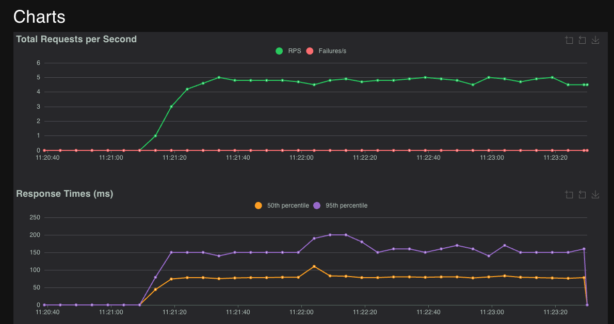

We used Locust to benchmark our API both before and after switching to ONNX Runtime. We simulated concurrent users making requests to the `/v1/predict` endpoint and measured response times. We tested the API with the original PyTorch (state_dict) model and after migrating to ONNX. The table below summarizes the improvements:

| Metric             | PyTorch (state_dict) | ONNX  | Improvement      |
|--------------------|----------------------|-------|------------------|
| Median (50th)      | 83ms                 | 63ms  | 24% faster       |
| Average            | 102ms                | 79ms  | 23% faster       |
| 95th percentile    | 170ms                | 140ms | 18% faster       |
| 99th percentile    | 220ms                | 170ms | 23% faster       |
| Max                | 310ms                | 220ms | 29% faster       |

ONNX Runtime provided a consistent 20-30% speedup in inference latency across all percentiles, with no loss in accuracy or reliability.

### Question 26

> **Did you manage to implement monitoring of your deployed model? If yes, explain how it works. If not, explain how**
> **monitoring would help the longevity of your application.**
>
> Recommended answer length: 100-200 words.
>
> Example:
> *We did not manage to implement monitoring. We would like to have monitoring implemented such that over time we could*
> *measure ... and ... that would inform us about this ... behaviour of our application.*
>
> Answer:

Yes, we implemented monitoring at multiple levels. The API exposes Prometheus metrics at `/metrics` including:

* `prediction_requests_total`: Total prediction count
* `predictions_by_class_total`: Predictions per class (drone/bird)
* `prediction_latency_seconds`: Inference time histogram with buckets from 10ms to 2.5s
* `request_size_bytes`: Upload size histogram
* `http_errors_total`: Error count by status code and reason
* `model_loaded_info`: Model loading status with version label

We configured the Cloud Run deployment with a GCP Managed Prometheus (GMP) sidecar (`cloud-run-gmp-sidecar:1.2.0`) to scrape these metrics. The sidecar configuration is in `cloud/cloudrun-api.yaml`. However, we had issues getting the metrics to appear in GCP Cloud Monitoring dashboards.

Beyond system metrics, we implemented drift monitoring with three detection levels: prediction-level (confidence scores, class distribution), image-level (brightness, contrast, RGB stats), and embedding-level (cosine similarity of ResNet features). For this, we used Evidently. A GitHub Actions workflow runs daily drift checks and uploads HTML reports as artifacts when drift is detected.

## Overall discussion of project

> In the following section we would like you to think about the general structure of your project.

### Question 27

> **How many credits did you end up using during the project and what service was most expensive? In general what do**
> **you think about working in the cloud?**
>
> Recommended answer length: 100-200 words.
>
> Example:
> *Group member 1 used ..., Group member 2 used ..., in total ... credits was spend during development. The service*
> *costing the most was ... due to ... . Working in the cloud was ...*
>
> Answer:

We spent around 400 DKK in total across all GCP services during the project. The breakdown:

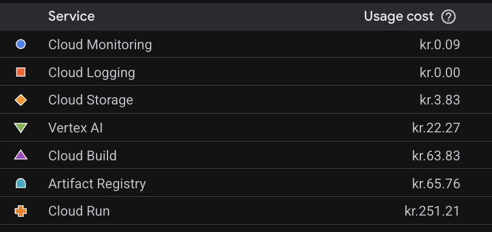

The most expensive service was Cloud Run. This makes sense since it runs continuously to serve our API with autoscaling enabled. The second most expensive was Artifact Registry for storing our Docker images, followed by Cloud Build for building those images. Vertex AI for GPU training was surprisingly cheap even though we were running a 20-trial hyperparameter sweep with T4 GPUs and in general training quite a bit. Cloud Storage was super low despite storing all our training data and models.

Working in the cloud was a mixed experience. The automatic scaling, managed services, and CI/CD integration were powerful, but GCP permissions were annoying to manage across a 5-person team. GPU quota limits and regional availability were also annoying. The pay-as-you-go model is nice for experimentation, but we can see how costs can add up quickly if you're not careful with Cloud Run instances or forget to tear down resources.

We tried to to break down spending by individual team member using GCP's billing reports, but we could not figure out how to access per-user usage.

### Question 28

> **Did you implement anything extra in your project that is not covered by other questions? Maybe you implemented**
> **a frontend for your API, use extra version control features, a drift detection service, a kubernetes cluster etc.**
> **If yes, explain what you did and why.**
>
> Recommended answer length: 0-200 words.
>
> Example:
> *We implemented a frontend for our API. We did this because we wanted to show the user ... . The frontend was*
> *implemented using ...*
>
> Answer:

We implement a Sveltekit frontend for our API and styled it with some nice colors inspired by our favorite energy drink that kept us going through the project, RedBull. See it here:

<https://drone-detector-frontend-66108710596.europe-north2.run.app/>

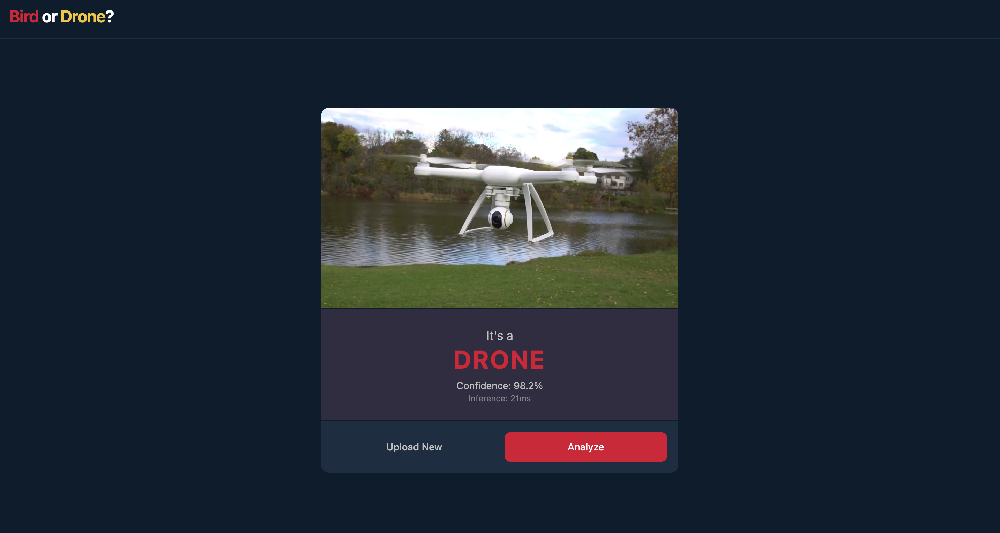

We also added a Github Actions check to make sure PR branch is up to date with main before running other workflows to minimize runner usage. We also set up Github to automatically delete branches after PR is merged. Lastly we created an invoke task that called Claude Code in headless mode, and asked it to use the `gh-pull-requests` skill to create a PR. It would read the diff of the PR and then create a PR that described the changes. We definitely see how the use of agentic AI can help in the drafting phase of a workflow of some of the more "boring" and tedious operations such as writing PR's and commit messages.

### Question 29

> **Include a figure that describes the overall architecture of your system and what services that you make use of.**
> **You can take inspiration from [this figure](figures/overview.png). Additionally, in your own words, explain the**
> **overall steps in figure.**
>
> Recommended answer length: 200-400 words
>
> Example:
>
> *The starting point of the diagram is our local setup, where we integrated ... and ... and ... into our code.*
> *Whenever we commit code and push to GitHub, it auto triggers ... and ... . From there the diagram shows ...*
>
> Answer:

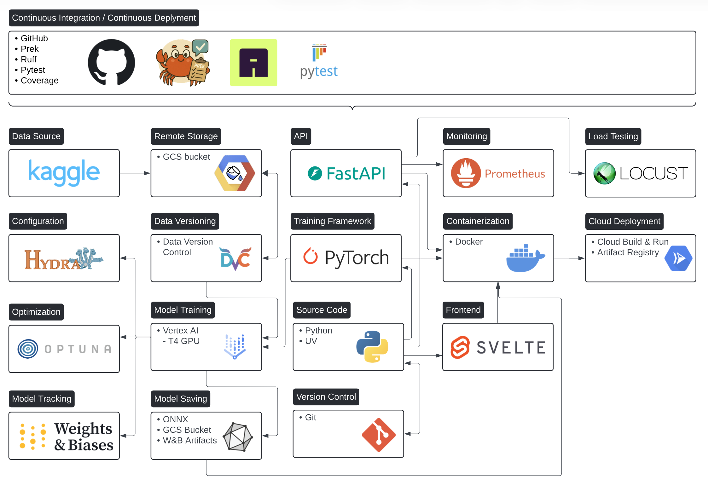

The followung will repeat some of the earlier things mentioned, but is a full overview of what we have done:

Our MLOps pipeline starts with local development, where we write Python code managed with uv for dependency management and Git for version control. We use Hydra for configuration management and PyTorch as our training framework.

Continuous Integration runs automatically on GitHub when we push code. GitHub Actions triggers Ruff for linting and pytest for unit testing, to make sure our code quality lives up to our and PEP8 standards before any deployment.

Data management begins with our dataset sourced from Kaggle, stored in GCS buckets and tracked with DVC for version control. The data versioning makes sure we have reproducibility for all team members.

Training pipeline uses Vertex AI with T4 GPUs, running PyTorch training jobs inside Docker containers. We use Optuna for hyperparameter optimization sweeps. All experiments are logged to Weights & Biases, tracking metrics, hyperparameters, and model artifacts.

Containerization happens through Docker, with images built using Cloud Build and stored in Artifact Registry. We have separate containers for training, API, and frontend.

Model deployment involves converting trained PyTorch models to ONNX format for faster CPU inference. The models are stored in GCS buckets and W&B artifacts, then loaded by our FastAPI backend.

Production infrastructure runs on Cloud Run, hosting both the FastAPI backend and SvelteKit frontend. Prometheus collects metrics from the API for monitoring. We also use Locust for load testing to validate performance under concurrent load.

We used Locust for load testing, however this isn't included in any action, as it is something we just wish to do on demand.

The entire pipeline is automated - pushing to main triggers deployment, while training jobs can be submitted with a single invoke command.

### Question 30

> **Discuss the overall struggles of the project. Where did you spend most time and what did you do to overcome these**
> **challenges?**
>
> Recommended answer length: 200-400 words.
>
> Example:
> *The biggest challenges in the project was using ... tool to do ... . The reason for this was ...*
>
> Answer:

The permissions in GCP was the bane of our existence. We always had to ask Linus (the owner of the project) to give us the permissions to do things. It was incredibly frustrating and time-consuming.

Another struggle was slow cloud training jobs, getting T4 GPU availability in our region, and low GPU utilization from slow GCS data loading. Docker build times were also pretty slow until we optimized with multi-stage builds and caching.

### Question 31

> **State the individual contributions of each team member. This is required information from DTU, because we need to**
> **make sure all members contributed actively to the project. Additionally, state if/how you have used generative AI**
> **tools in your project.**
>
> Recommended answer length: 50-300 words.
>
> Example:
> *Student sXXXXXX was in charge of developing of setting up the initial cookie cutter project and developing of the*
> *docker containers for training our applications.*
> *Student sXXXXXX was in charge of training our models in the cloud and deploying them afterwards.*
> *All members contributed to code by...*
> *We have used ChatGPT to help debug our code. Additionally, we used GitHub Copilot to help write some of our code.*
> Answer:

We worked collaboratively throughout the project, with all members contributing to different aspects of the MLOps pipeline. While each person had primary areas of focus, everyone participated well.

#### Individual contributions

* **Linus Juni** (s225224): Initial model architecture and training/evaluation scripts, cloud/local storage abstraction system, DVC setup and GCS bucket data storage, API backbone setup, Docker containerization, GCP project setup and permissions management, Cloud Build and Cloud Run deployment, Hydra/Optuna hyperparameter sweeps, Vertex AI training infrastructure, W&B experiment tracking integration, load testing with Locust
* **Rasmus Pedersen** (s205357): Test suite, drift monitoring implementation, Hydra configuration, CI workflow optimizations
* **Buster Nielsen** (s211548): CI/CD pipeline development (build, deploy, train workflows), inference data collection to GCS
* **Mathilde** (s254124): Profiling setup, initial testing framework, code quality enforcement with Ruff
* **Andreas** (s215489): API development with Prometheus monitoring, MkDocs documentation (<https://dtu-mlops.github.io/drone-detection-mlops/>), frontend implementation (<https://drone-detector-frontend-66108710596.europe-north2.run.app/>), data change detection workflow

### Use of generative AI tools

We used AI tools from Anthropic, Google and OpenAI. The most used was Claude Code, which was used throughout the project for development, debugging and writing documentation. Claude Code was particularly helpful for writing boilerplate code, debugging GCP permission issues, and generating PR descriptions through a custom invoke task. All architectural decisions, design choices, and implementation work remain entirely our own.
